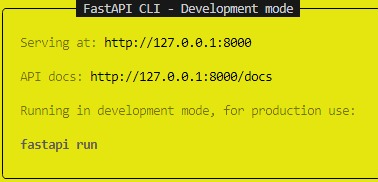
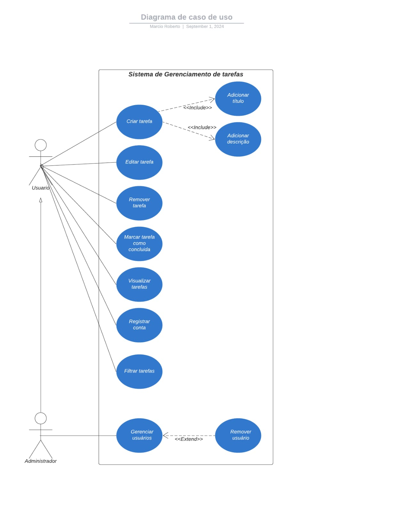
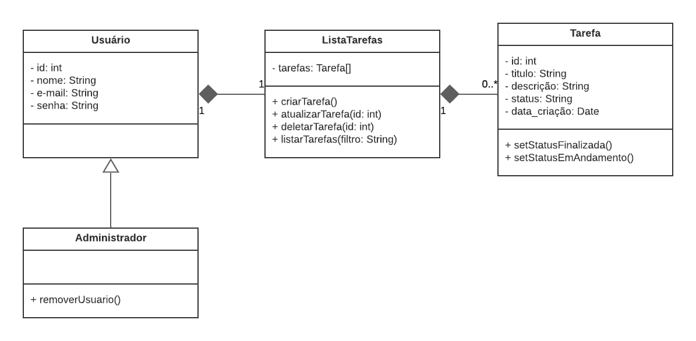
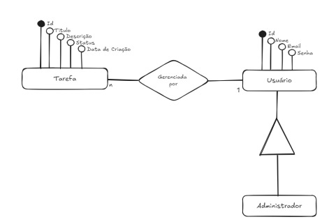
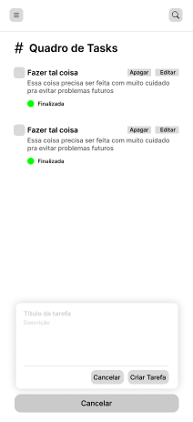
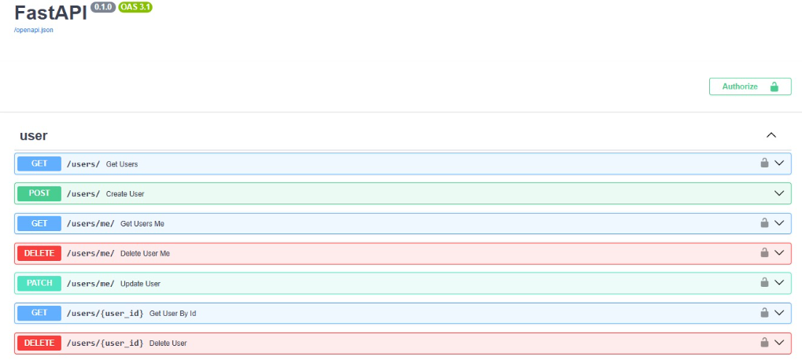
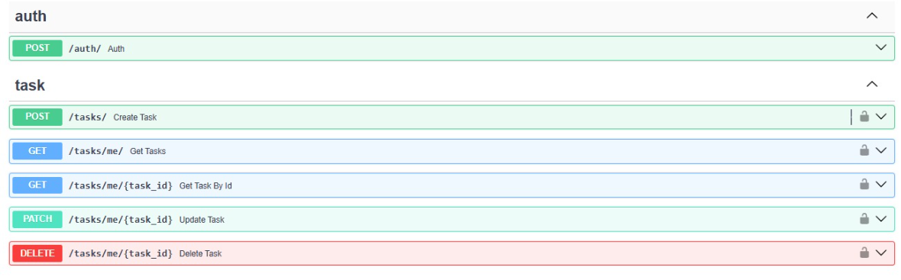

# Prosel-EcompJR

# Introdução

A Ecomp Jr, empresa júnior de Engenharia de Computação da UEFS, identificou uma necessidade urgente de aprimorar a gestão de tarefas entre seus membros e administradores. O sistema atual, baseado em processos manuais, gera dificuldades de organização e acompanhamento, impactando diretamente na eficiência das atividades. Assim, este projeto tem como objetivo desenvolver uma aplicação de lista de tarefas (to-do list) que proporcione uma solução prática e intuitiva. Utilizando React.js para o front-end, FastAPI para o back-end e SQLite como banco de dados, a aplicação permitirá o gerenciamento de tarefas pelos usuários e o controle de usuários por administradores. Com isso, a Ecomp Jr espera otimizar seus processos internos, facilitando o acompanhamento e a execução das atividades diárias.

# Sumário
- <A href = "#Intr">Introdução</A> 
- <A href = "#Exec">Como Executar</A> 
- <A href = "#Diag">Diagramas UML</A> 
- <A href = "#Prot">Prototipação</A> 
- <A href = "#Front">Front-End</A> 
- <A href = "#Back">Back-End</A> 
- <A href = "#Inte">Integração</A> 
- <A href = "#Conc">Conclusão</A> 

# Como Executar

## Etapas:

### 1. Configuração do Ambiente:
   
  - Para utilizar essa aplicação, é essencial que o ambiente esteja devidamente configurado. Primeiramente, é necessário ter a linguagem Python instalada no sistema, pois a partir dela será possível realizar a instalação do FastAPI, juntamente com ferramentas como Poetry e Pyenv, utilizando o comando pip install. Além disso, é fundamental dispor de um ambiente de desenvolvimento integrado (IDE), que facilitará a execução dos comandos e o gerenciamento da aplicação de maneira eficiente. Outro ponto a ser observado é a instalação do Node.js, indispensável para criar e rodar o front-end em React. Com essas dependências devidamente configuradas, o desenvolvimento e a execução da aplicação ocorrerão de forma fluida e organizada.
     
### 2. Obtenção do Código Fonte:

   - **Clonagem do Repositório:** Você pode utilizar o seguinte comando no terminal para adquirir a aplicação:                                          

           git clone https://github.com/MarcioDzn/Prosel-EcompJR.git.
     
   - **Download do Código Fonte:** Caso não tenha o Git na máquina, você pode fazer o download desse repositório manualmente. Vá até o canto superior, selecione "Code" e depois "Download ZIP", e então extraia o arquivo ZIP na sua máquina.

### 3. Configuração da Aplicação:

 # Back-End:
   Primeiramente, para conseguirmos executar a API, devemos executar esses passos respectivamante:

   1.     cd todo_list
   2.     poetry install
   3.     poetry shell
   4.     alembic upgrade head
   
   `Observação:` Para que essa etapa ocorra normalmente é necessário que você esteja com o projeto aberto na pasta principal.

 # Front-End:

 > :construction: Em construção :construction:

### 4. Execução da Aplicação:

 # Back-End:
   Após ter realizado adequadamente a configuração da aplicação, podemos iniciar a API através do comando:  
 
       fastapi dev todo_list/app.py
   Pronto, agora você poderá fazer testes com a API clicando em Ctrl e na rota API docs conforme está ilustrado na Figura 1.

   

   
   
     <em>Figura 1. Imagem API em execução.</em>  
   
   

   
# Front-End:

  > :construction: Em construção :construction:

# Diagramas
## Diagrama de Casos de Uso

   
   
     <em>Figura 2. Diagrama de Caso de Uso.</em>  
   
   

## Diagrama de Classes

   
   
     <em>Figura 3. Diagrama de Classes.</em>  
   
   

## Diagrama de Entidade e Relacionamento

   
   
     <em>Figura 4. Diagrama de Entidade e Relacionamento.</em>  
   
   

   

# Prototipação

Essa seção é destinada a ilustração dos prototipos das telas, desenvolvidadas com a ferramenta Figma.

   
   
     <em>Figura 5. Protótipo Tela de Login.</em>  
   
   

  

   
   
     <em>Figura 6. Protótipo Tela de Cadastro de Conta.</em>  
   
   

   

   
   
     <em>Figura 7. Protótipo Menu Lateral.</em>  
   
   

   

   
   
     <em>Figura 8. Protótipo Tela de Criação e Visualização de Tasks.</em>  
   
   

   

   
   
     <em>Figura 9. Protótipo Tela Campo Insersão de Dados para Criação de Task.</em>  
   
   

   

   
   
     <em>Figura 10. Protótipo Tela de Edição de Task.</em>  
   
   

   

   
   
     <em>Figura 11. Protótipo Tela de Gerencia de Usuários.</em>  
   
   

   `Observação:` Note que a prototipação foi feita para aplicações mobile, ou seja, uma abordagem "mobile first", isto porque facilitaria o uso de qualquer pessoa com um celular. 

# Front-End

> :construction: Em construção :construction:

# Back-End

O back-end da aplicação foi desenvolvido utilizando FastAPI, uma poderosa ferramenta para construir APIs modernas e de alto desempenho em Python. Esse framework oferece simplicidade no desenvolvimento e escalabilidade, permitindo uma rápida criação de rotas, controle de requisições e respostas, além de integração eficiente com bancos de dados, como o SQLite, utilizado neste projeto.

A estrutura do back-end segue uma arquitetura clara e modular, facilitando a manutenção e a extensão de funcionalidades. Entre as principais operações implementadas estão as rotinas de autenticação e autorização de usuários, criação e gerenciamento de tarefas, além do controle de administradores para a gestão de outros usuários. Cada operação foi estruturada seguindo boas práticas de desenvolvimento, como separação de responsabilidades e tratamento de erros robusto.

Para o gerenciamento de banco de dados, optou-se por utilizar o SQLAlchemy, uma biblioteca ORM (Object-Relational Mapping), que facilita a interação com o SQLite. Com isso, as consultas e operações no banco são realizadas de forma mais intuitiva e segura. A segurança foi uma prioridade no back-end, implementando o armazenamento seguro de senhas e verificação de credenciais para determinadas ações, evitando que informações sensíveis sejam armazenadas de maneira vulnerável.

Esse conjunto de tecnologias e práticas garante que o back-end da aplicação não apenas atenda às necessidades funcionais do sistema, mas também ofereça um desempenho eficiente e escalável, além de garantir a segurança e a integridade dos dados dos usuários.

# Integração

Ainda não foi feita a integração do Back-end com o front-End, visto que este ultimo ainda não está finalizado, contudo, o desenvolvimento do Back-End está pronto e pode ser testado através da API.

 

   
   
     <em>Figura 12. Interface do FastAPI para uso dinâmico da API - Rotas de Usuário.</em>  
   
   

   
   
     <em>Figura 13. Interface do FastAPI para uso dinâmico da API - Rotas de Task e Autenticação de Usuário.</em>  
   
   
  
 

# Conclusão

O desenvolvimento desta aplicação de lista de tarefas para o processo seletivo da EcompJr, representou uma oportunidade de profundo aprendizado técnico e colaborativo para todos os coloradores do projeto. A experiência também proporcionou um mergulho no desenvolvimento fullstack, envolvendo React.js para o Front-End, FastAPI para o Back-End e SQLite para o Banco de Dados, além de aprimorar habilidades de trabalho em equipe e organização de projetos. Além disso, ao longo do processo, o entendimento sobre a importância da segurança de dados, da prototipação e do uso de boas práticas no código ficou mais claro, demonstrando como essas etapas impactam diretamente na qualidade final do produto. 

 
