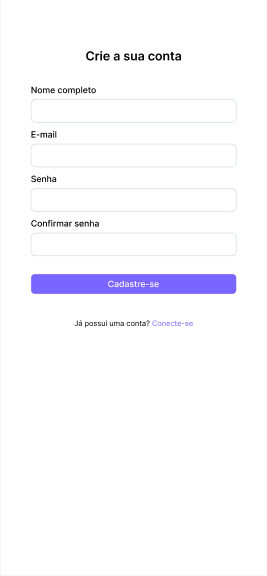
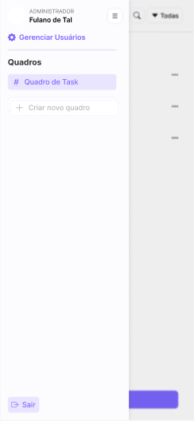
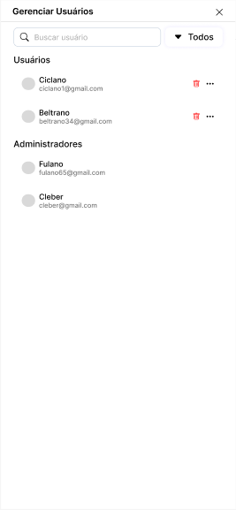
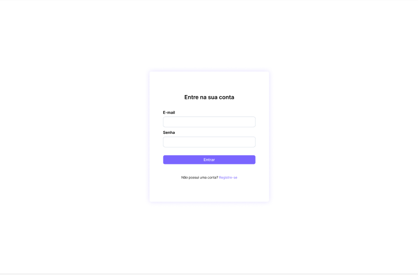
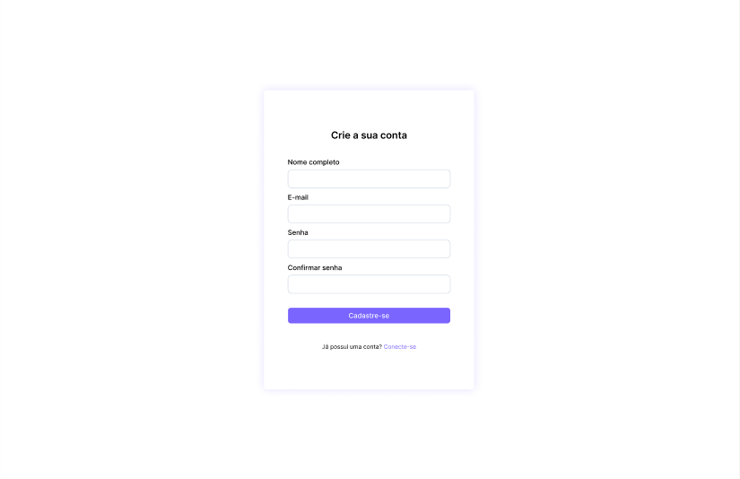
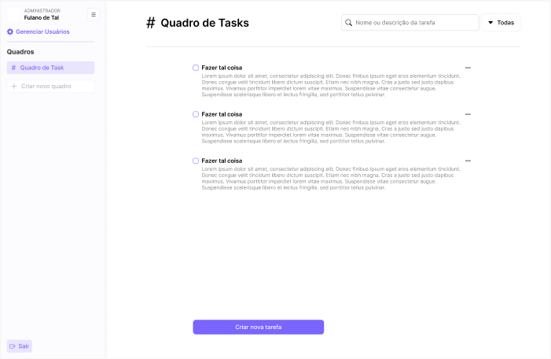
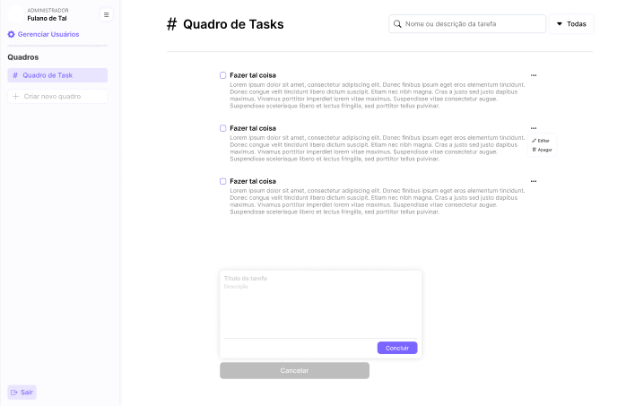
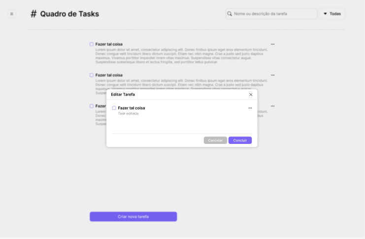
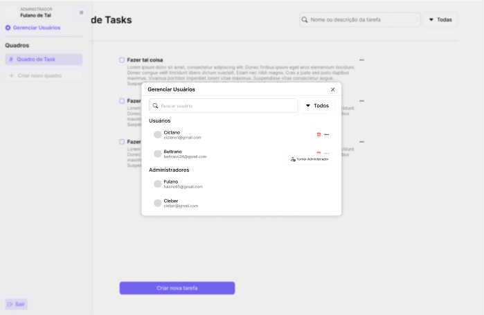

<div align="center">

# Prosel-EcompJR

</div>

<A id= "Intr"></A>

## Introdução

<div align="justify">
A Ecomp Jr, empresa júnior de Engenharia de Computação da UEFS, identificou uma necessidade urgente de aprimorar a gestão de tarefas entre seus membros e administradores. O sistema atual, baseado em processos manuais, gera dificuldades de organização e acompanhamento, impactando diretamente na eficiência das atividades. Assim, este projeto tem como objetivo desenvolver uma aplicação de lista de tarefas (to-do list) que proporcione uma solução prática e intuitiva. Utilizando React.js para o front-end, FastAPI para o back-end e SQLite como banco de dados, a aplicação permitirá o gerenciamento de tarefas pelos usuários e o controle de usuários por administradores. Com isso, a Ecomp Jr espera otimizar seus processos internos, facilitando o acompanhamento e a execução das atividades diárias.
</div>

## Sumário
- <A href = "#Intr">Introdução</A><br>
- <A href = "#Config_Amb">Configuração do Ambiente</A><br>
- <A href = "#API">API</A><br>
- <A href = "#Exec">Execução</A><br>
- <A href = "#Diag">Diagramas UML</A><br>
- <A href = "#Prot">Prototipação</A><br>
- <A href = "#Front">Front-End</A><br>


<A id="Config_Amb"></A>
## 1. Configuração do Ambiente
   
Para utilizar essa aplicação, é essencial que o ambiente esteja devidamente configurado. Primeiramente, é necessário ter a linguagem Python instalada no sistema, pois a partir dela será possível realizar a instalação do FastAPI.

Para executar o projeto, é necessário utilizar um ambiente virtual, criado e executado por meio do Pyenv. Além disso, o gerenciador de pacotes Poetry foi utilizado, a fim de gerenciar as dependências e o ambiente virtual.

Por fim, para uma futura execução da interface, ainda não finalizada, é necessária a instalação do Node.js, ferramenta indispensável para criar e rodar o ReactJS. 

Com essas dependências devidamente configuradas, o desenvolvimento e a execução da aplicação ocorrerão de forma fluida e organizada.

<A id="Exec"></A>
## 2. Execução

   1. Clone o repositório:                                          
   ```bash
   git clone https://github.com/MarcioDzn/Prosel-EcompJR.git.
   ```
          
   2. Navegue até o diretório principal:
   ```bash
   cd todo_list
   ```

   3. Ative o ambiente virtual:
   ```bash
   poetry shell
   ```

   4. Instale as dependências:
   ```bash
   poetry install
   ```

   5. Construa o Banco de Dados:
   ```bash
   alembic upgrade head
   ```

   6. Execute a API:
   ```bash
   fastapi dev todo_list/app.py
   ```

Após a execução da API, o seguinte "painel" será exibido no terminal:
<div align="center">


<br/> <em>Figura 1. Imagem API em execução.</em> <br/>

</div>

O próprio *fastapi* disponibiliza uma documentação feita automaticamente a partir do *Swagger*, para visualizá-la deve-se acessar a segunda URL fornecida no painel supracitado.

<A id="API"></A>
## 3. API
As imagens abaixo ilustram as rotas e endpoints disponíveis na API.  Vale salientar que muitas das rotas são protegidas, ou seja, só podem ser executadas com autenticação prévia.

### Rota /users
#### **GET /users** 
Retorna uma lista com os dados de todos os usuários cadastrados.
> Apenas usuários autenticados e com o tipo "administrator" podem ter acesso a essa rota.

Exemplo de resposta:
```
{
  "users": [
    {
      "id": 0,
      "name": "string",
      "email": "user@example.com",
      "type": "user",
      "created_at": "2024-09-30T19:30:32.040Z"
    }
  ]
}
```
- Status de sucesso: **200 OK**

#### **POST /users** 
Permite a criação de um novo usuário a partir dos dados fornecidos. 

Exemplo de corpo da requisição:
```
{
  "name": "string",
  "email": "user@example.com",
  "password": "string",
  "type": "user"
}
```

- Status de sucesso: **201 CREATED**
- Status de erro: **422 VALIDATION ERROR**

#### **GET /users/me**
Retorna os dados do usuário autenticado. 
> Apenas usuários autenticados podem ter acesso a essa rota.

Exemplo de resposta:
```
{
   "id": 0,
   "name": "string",
   "email": "user@example.com",
   "type": "user",
   "created_at": "2024-09-30T19:30:32.040Z"
}
```

- Status de sucesso: **200 OK**

#### **DELETE /users/me**
Remove o usuário autenticado do banco de dados. 
> Apenas usuários autenticados podem ter acesso a essa rota.

- Status de sucesso: **200 OK**

#### **PATCH /users/me**
Permite a edição de dados do usuário autenticado. Não é necessário informar todos os dados para realizar a atualização.

Exemplos de corpo da requisição:
- Exemplo 1:
```
{
   "name": "string"
}
```

- Exemplo 2:
```
{
   "password": "string"
}
```

> Apenas usuários autenticados podem ter acesso a essa rota.
> Apenas administradores podem alterar o campo "type"

- Status de sucesso: **200 OK**

#### **GET /users/{user_id}**
Retorna os dados de um usuário com um id específico.
> Apenas usuários autenticados e com o tipo "administrator" podem ter acesso a essa rota.

Exemplo de resposta:
```
{
   "id": 0,
   "name": "string",
   "email": "user@example.com",
   "type": "user",
   "created_at": "2024-09-30T19:30:32.040Z"
}
```

- Status de sucesso: **200 OK**

#### **DELETE /users/{user_id}**
Remove um usuário a partir de seu id.
> Apenas usuários autenticados e com o tipo "administrator" podem ter acesso a essa rota.

- Status de sucesso: **200 OK**

### Rota /tasks
#### **POST /tasks** 
Cria uma nova tarefa associada ao usuário atualmente autenticado. 
> Apenas usuários autenticados podem ter acesso a essa rota.

Exemplo de corpo da requisição:
```
{
  "title": "string",
  "description": "string",
  "status": "doing"
}
```

- Status de sucesso: **201 CREATED**
- Status de erro: **422 VALIDATION ERROR**

#### **GET /tasks/me** 
Retorna todas as tarefa relacionadas ao usuário autenticado. 
> Apenas usuários autenticados podem ter acesso a essa rota.

Exemplo de resposta:
```
{
  "tasks": [
    {
      "id": 0,
      "title": "string",
      "description": "string",
      "status": "doing",
      "created_at": "2024-09-30T19:29:46.340Z"
    }
  ]
}
```

- Status de sucesso: **200 OK**

#### **GET /tasks/me/{task_id}**
Retorna uma tarefa específica de um usuário autenticado a partir de seu id. 
> Apenas usuários autenticados podem ter acesso a essa rota.

Exemplo de resposta:
```
{
   "id": 0,
   "title": "string",
   "description": "string",
   "status": "doing",
   "created_at": "2024-09-30T19:29:46.340Z"
}
```

- Status de sucesso: **200 OK**

#### **PATCH /users/me/{task_id}**
Permite a edição uma tarefa específica de um usuário autenticado a partir de seu id.
> Apenas usuários autenticados podem ter acesso a essa rota.

- Status de sucesso: **200 OK**

#### **DELETE /users/me/{task_id}**
Remove uma tarefa específica de um usuário autenticado a partir de seu id.
> Apenas usuários autenticados podem ter acesso a essa rota.

- Status de sucesso: **200 OK**

### Rota /auth
#### POST /auth/
Permite a autenticação de um usuário a partir de suas credênciais (e-mail e senha)

- Status de sucesso: **200 OK**

### Segurança
Como já mencionado, muitas rotas necessitam de autenticação prévia para que sejam executadas. As únicas exceções são a `POST /users`, necessária para a criação de novas contas e a `POST /auth`, a qual permite a autenticação de um usuário.

Para a realização da segurança utilizou-se os frameworks `passlib`, para a encriptação de senhas e `pyjwt`, para a criação de *tokens* de autenticação.

Caso o usuário tente acessar uma rota protegida sem a devida autenticação prévia um erro será exibido, com o status: **401 UNAUTHORIZED**.
 

<A id="Diag"></A>
## 4. Diagramas
### Diagrama de Casos de Uso

<div align="center">
   
   
   <br/> <em>Figura 2. Diagrama de Caso de Uso.</em> <br/>
   
   </div>

### Diagrama de Classes

<div align="center">
   
   
   <br/> <em>Figura 3. Diagrama de Classes.</em> <br/>
   
   </div>

### Diagrama de Entidade e Relacionamento

<div align="center">
   
   
   <br/> <em>Figura 4. Diagrama de Entidade e Relacionamento.</em> <br/>
   
   </div>
   
<A id="Prot"></A>
## 5. Prototipação

Essa seção é destinada a ilustração dos prototipos das telas, desenvolvidadas com a ferramenta Figma.

### Mobile
<div align="center">
   
   
   <br/> <em>Figura 5. Protótipo Tela de Login para Mobile</em> <br/>
   
   </div>

  <div align="center">
   
   
   <br/> <em>Figura 6. Protótipo Tela de Cadastro de Conta para Mobile</em> <br/>
   
   </div>

   <div align="center">
   
   
   <br/> <em>Figura 7. Protótipo Menu Lateral para Mobile</em> <br/>
   
   </div>

   <div align="center">
   
   
   <br/> <em>Figura 8. Protótipo Tela de Criação e Visualização de Tarefas para Mobile</em> <br/>
   
   </div>

   <div align="center">
   
   
   <br/> <em>Figura 9. Protótipo Tela Campo Insersão de Dados para Criação de Tarefa para Mobile</em> <br/>
   
   </div>

   <div align="center">
   
   
   <br/> <em>Figura 10. Protótipo Tela de Edição de Tarefa para Mobile</em> <br/>
   
   </div>

   <div align="center">
   
   
   <br/> <em>Figura 11. Protótipo Tela de Gerencia de Usuários para Mobile</em> <br/>
   
   </div>


### Desktop
<div align="center">
   
   
   <br/> <em>Figura 12. Protótipo Tela de Login para Desktop</em> <br/>
   
   </div>

  <div align="center">
   
   
   <br/> <em>Figura 13. Protótipo Tela de Cadastro de Conta para Desktop</em> <br/>
   
   </div>

   <div align="center">
   
   
   <br/> <em>Figura 14. Protótipo Tela de Criação e Visualização de Tarefas para Desktop</em> <br/>
   
   </div>

   <div align="center">
   
   
   <br/> <em>Figura 15. Protótipo Tela Campo Insersão de Dados para Criação de Tarefa para Desktop</em> <br/>
   
   </div>

   <div align="center">
   
   
   <br/> <em>Figura 16. Protótipo Tela de Edição de Tarefa para Desktop</em> <br/>
   
   </div>

   <div align="center">
   
   
   <br/> <em>Figura 17. Protótipo Tela de Gerencia de Usuários para Desktop</em> <br/>
   
   </div>

<A id="Front"></A>
## Front-End

> :construction: Em construção :construction:

 
